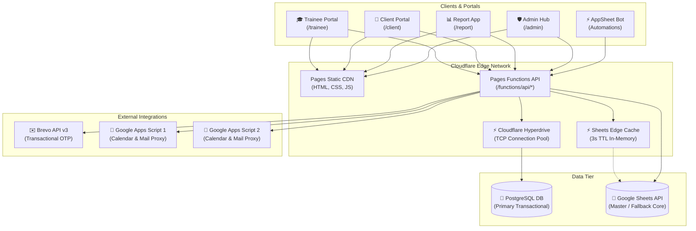
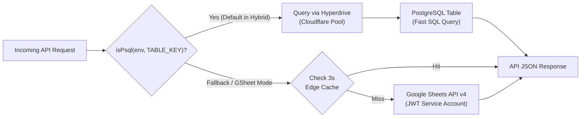
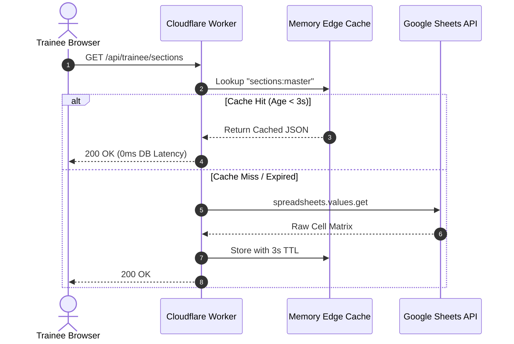
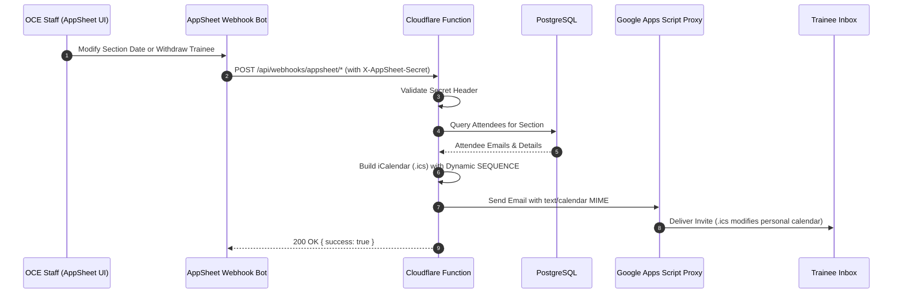

# Architecture & Data Flow

This document details the hybrid edge architecture of PD Hub. The system bridges modern low-latency serverless edge compute on Cloudflare with enterprise transactional storage (PostgreSQL) and legacy spreadsheet automation (Google Sheets / AppSheet).

---

## 1. High-Level Architecture Diagram

---

## 2. Hybrid Data Source Routing Pattern

Every database table lookup dynamically checks whether PostgreSQL or Google Sheets should serve the request using the `functions/_lib/data-source.js` registry.

### Table Source Determination Logic
1. **Global Default (`env.DB_MODE`):**
   - If `env.DB_MODE === 'psql'` (production default): Routes queries to PostgreSQL tables.
   - If `env.DB_MODE === 'gsheet'`: Routes queries to Google Sheets tabs.
2. **Per-Table Override (`TAB_<KEY>_SOURCE`):**
   - Individual tables can be independently toggled between sources via environment variables (e.g. `TAB_TRAINEE_PROFILE_SOURCE=psql`, `TAB_ORGANIZATION_SOURCE=psql`).
3. **Hyperdrive Binding (`env.HYPERDRIVE`):**
   - Provides edge connection pooling. If the Hyperdrive binding is unavailable (e.g. local preview), the adapter automatically falls back to direct `env.POSTGRES_CONNECTION_STRING` or Google Sheets.

---

## 3. High-Concurrency Mitigation: Sheets Edge Cache

When operating in Google Sheets fallback mode or reading sheets metadata, Google API has a strict quota of **300 requests per minute per project**.

### Write-Through Invalidation
To eliminate race conditions (such as double registration or check-in collisions):
- All write actions (e.g., `POST /api/trainee/register`, `POST /api/trainee/checkin/submit`) execute with **Cache-Bypass**.
- Upon a successful commit, the edge cache key for that entity is immediately purged or updated (Write-Through).

---

## 4. AppSheet Calendar Synchronization Flow

When class schedules change or registrations are cancelled via AppSheet, webhooks trigger real-time calendar updates via `.ics` attachments sent to trainees:

---

## 5. Dual-GAS Email Load Balancing & Smart Fallback

To mitigate daily quota limits imposed by Google Apps Script and ensure uninterrupted transactional email delivery, the outbound email pipeline employs a deterministic 50/50 round-robin rotation and a multi-tier fallback cascade.

### 5.1. Deterministic Load Balancing
Outbound emails (OTP codes, registration confirmations, cancellation notices, and schedule updates) are dispatched via `functions/_lib/email-sender.js`:
- A deterministic `djb2` hash is computed from the recipient's normalized email address.
- Hash modulo 2 directs the email to either **GAS 1** (Slot 0) or **GAS 2** (Slot 1).
- This ensures an even 50/50 traffic split without requiring distributed state storage.

### 5.2. Multi-Tier Fallback Cascade
If an attempt to dispatch through the assigned service encounters an error (network failure, rate limit, quota exhaustion):
1. **Primary**: Assigned Google Apps Script (GAS 1 or GAS 2).
2. **First Fallback**: **Brevo API v3** (Direct transactional email with ICS attachments supported).
3. **Second Fallback**: Alternate Google Apps Script (e.g. if GAS 1 was primary, GAS 2 is attempted).

### 5.3. Service Keep-Alive Automation
To prevent Brevo API credentials from being marked inactive or dormant during low-traffic periods:
- An administrative endpoint `POST /api/admin/email-keepalive` is protected by `KEEPALIVE_TOKEN`.
- A scheduled GitHub Actions workflow (`.github/workflows/email-keepalive.yml`) pings this endpoint quarterly (~every 80 days), triggering a small heartbeat test email to `eoffice2@eiu.edu.vn`.

