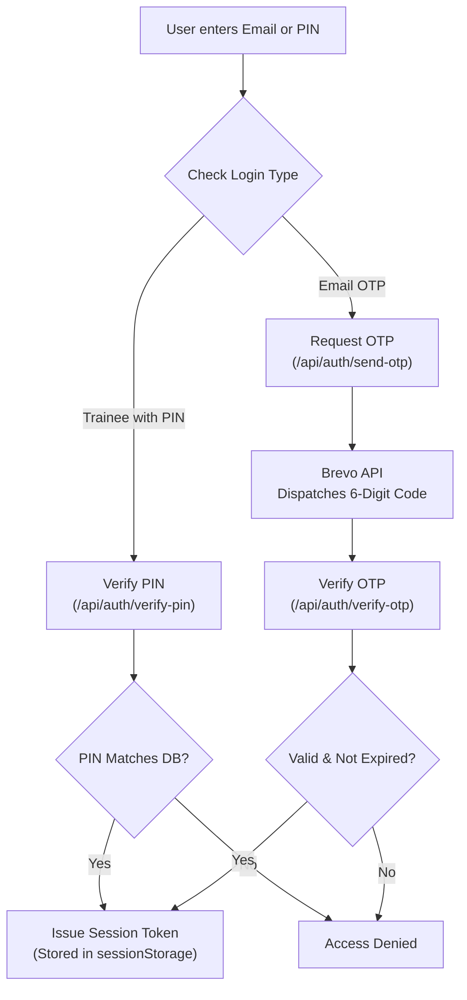

# Security, Authentication & Roles

This document covers authentication flows, session handling, Role-Based Access Control (RBAC), and security hardening in PD Hub.

---

## 1. Authentication Mechanisms

---

## 2. 4-Digit PIN Security
- **Target Audience:** EIU students, faculty, and recurring corporate trainees.
- **Leading Zero Text Integrity:**
  - Standard integer parsing truncates `0123` to `123`.
  - The database adapter and frontend treat PINs strictly as `VARCHAR` / `TEXT` and enforce `String(pin).padStart(4, '0')` during comparison to guarantee leading zeros are never lost.
- **PIN Change & Management:**
  - Trainees and Admins can update their 4-digit PIN in their respective Profile panels (`POST /api/trainee/pin/update` and `POST /api/admin/pin/update`).

---

## 3. Real OTP Email Delivery (Brevo)
- **Email Service Provider:** Brevo (formerly Sendinblue) v3 REST API.
- **Transient Storage:** OTP records are written with an explicit expiration (`expires_at`, 10 minutes default) into the `temp_otp` table/sheet.
- **Frontend Protection:**
  - Resend buttons are throttled by a 60-second countdown timer.
  - Verification inputs are locked to numeric input mode (`inputmode="numeric"`, `maxlength="6"`).

---

## 4. Role-Based Access Control (RBAC)

User permissions are evaluated against the `pdc_user_roles` master table:

| Role | Permitted Portals & Endpoints | Permissions |
|---|---|---|
| `admin` | `/admin/index.html`, `/report.html`, All APIs | Full operational control, role assignment, status checks, logs inspection. |
| `report_viewer` | `/report.html`, `GET /api/report/*` | Read-only analytics; redirected away from `/admin/index.html` if attempted. |
| *(Trainee)* | `/trainee/index.html`, `/api/trainee/*` | Scoped to own profile, registrations, and active courses. |
| *(Client)* | `/client/index.html`, `/api/client/*` | Scoped to inquiries matching corporate email. |

### Emergency Recovery Access (`DEBUG_TOKEN`)
In the event that email providers or OAuth tokens are temporarily disrupted, an emergency `DEBUG_TOKEN` can be supplied directly in the Admin login shell.
- **No Persistence:** The debug token is never stored in `sessionStorage` or cookies; it is passed as a one-time header for deep operational diagnostic retrieval.
