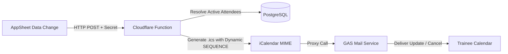

# AppSheet & Calendar Automations

This guide explains the integration between Google AppSheet, Cloudflare Pages Functions, and personal calendar synchronization (`.ics` calendar attachments).

---

## 1. Overview & Mechanics

When administrators update schedules or cancel registrations in Google AppSheet, bots dispatch webhooks to the Cloudflare edge backend. Cloudflare generates standard RFC 5545 iCalendar (`.ics`) payloads and dispatches them to trainees via the Google Apps Script proxy or email transport.



### Critical Engineering Safeguards
1. **MIME Type Differentiation:**
   - Registration update: `Content-Type: text/calendar; method=REQUEST; name="schedule-update.ics"`
   - Cancellation: `Content-Type: text/calendar; method=CANCEL; name="schedule-cancellation.ics"`
   - Distinct filenames prevent MIME boundary collisions and guarantee Outlook/Google Calendar recognize the action.
2. **Dynamic SEQUENCE Timestamp:**
   - Calendar clients discard events if the `SEQUENCE` number is lower than or equal to an earlier event.
   - Cloudflare dynamically computes `SEQUENCE: Math.floor(Date.now() / 1000)` on every broadcast, guaranteeing incoming revisions override previous entries.
3. **Webhook Security:**
   - AppSheet bots must send the secret header: `x-appsheet-secret: <APPSHEET_WEBHOOK_SECRET>`
   - Unauthenticated requests are rejected immediately with HTTP 401.

---

## 2. API Endpoints

### 1. Update Schedule (Mass or Individual)
- **Endpoint:** `POST /api/webhooks/appsheet/update-schedule`
- **Headers:**
  ```http
  Content-Type: application/json
  x-appsheet-secret: radoenstring#$appsheet2026
  ```
- **Payload Schema:**
  ```json
  {
    "sectionId": "<<[section id]>>",
    "traineeEmail": "<<[trainee id]>>",
    "courseNameEn": "<<[course id].[course name en]>>",
    "newSectionDate": "<<[section id].[section date]>>",
    "venue": "<<[section id].[section venue]>>"
  }
  ```
- **Behavior:** If `traineeEmail` is provided, sends update to that specific attendee; if omitted, queries all active attendees enrolled in `sectionId` and broadcasts updates.

---

### 2. Cancel Registration
- **Endpoint:** `POST /api/webhooks/appsheet/cancel-registration`
- **Headers:**
  ```http
  Content-Type: application/json
  x-appsheet-secret: radoenstring#$appsheet2026
  ```
- **Payload Schema:**
  ```json
  {
    "traineeEmail": "<<[trainee id]>>",
    "sectionId": "<<[section id]>>",
    "courseNameEn": "<<[course name en]>>",
    "sectionDate": "<<[section date]>>"
  }
  ```
- **Behavior:** Emits `METHOD:CANCEL` `.ics` attachment to revoke the event from the trainee's calendar.

---

## 3. AppSheet Bot Configuration

### Bot 1: Schedule Update Bot
1. **Event Configuration:**
   - **Data source:** `SECTION`
   - **Change type:** `Updates only`
   - **Condition:**
     ```excel
     [_THISROW_BEFORE].[section date] <> [_THISROW_AFTER].[section date]
     ```
2. **Task Configuration:**
   - **Action type:** `Call a webhook`
   - **URL:** `https://your-domain.pages.dev/api/webhooks/appsheet/update-schedule`
   - **HTTP Method:** `POST`
   - **HTTP Headers:** `x-appsheet-secret: radoenstring#$appsheet2026`
   - **Body Template:** JSON schema matching Section 2.1 above.

### Bot 2: Registration Cancellation Bot
1. **Event Configuration:**
   - **Data source:** `SECTION_ATTENDEE`
   - **Change type:** `Updates only`
   - **Condition:**
     ```excel
     [registration status] = "Withdrawn" AND [_THISROW_BEFORE].[registration status] <> "Withdrawn"
     ```
2. **Task Configuration:**
   - **Action type:** `Call a webhook`
   - **URL:** `https://your-domain.pages.dev/api/webhooks/appsheet/cancel-registration`
   - **HTTP Method:** `POST`
   - **HTTP Headers:** `x-appsheet-secret: radoenstring#$appsheet2026`
   - **Body Template:** JSON schema matching Section 2.2 above.
